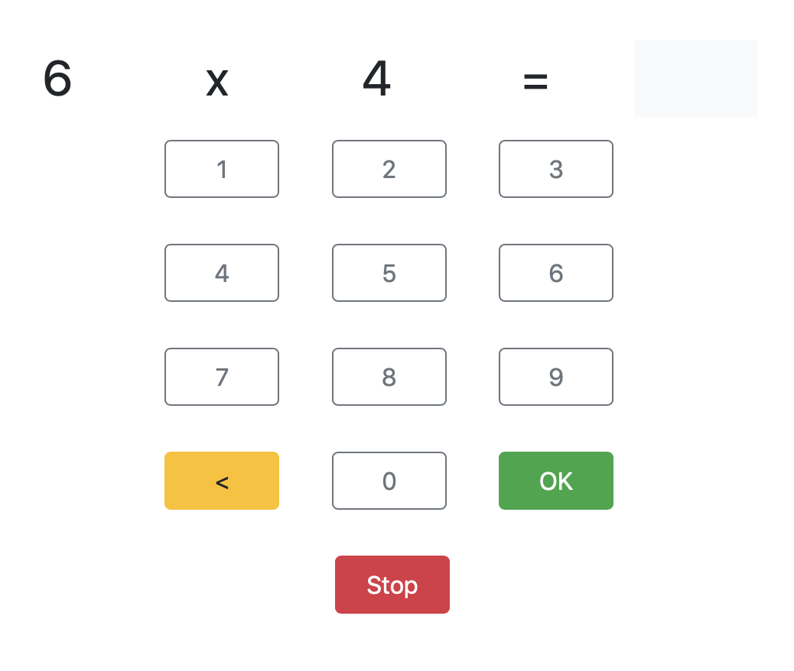

# Maaltafels

> Oefen maaltafels met opvolging.

## Features

- selectie maaltafels
- tijdopname
- rapportering van resultaten
- UI gericht op iPad

## Setup

1. [](https://heroku.com/deploy)

2. Maak een `users` collection aan, met een document per gebruiker. Bv.:

```mongo
> db.users.insertOne({"_id": "default", "pass" : "default"})
{ "acknowledged" : true, "insertedId" : "default" }
> db.users.find().pretty()
{ "_id" : "default", "pass" : "default" }
```

## Gebruik

Bezoek de URL van je Heroku deployment, geen de gebruikernaam (`_id`) en het paswoord (`pass`) in.

Selecteer welke maaltafels je wilt oefenen. Kies optioneel hoe lang je wilt oefenen.


Oefenen maar!



Na het oefenen krijg je feedback over je sessie en je evolutie.


## Opvolging

Voeg `/report` toe aan de URL om een rapport over het oefenen te raadplegen.


