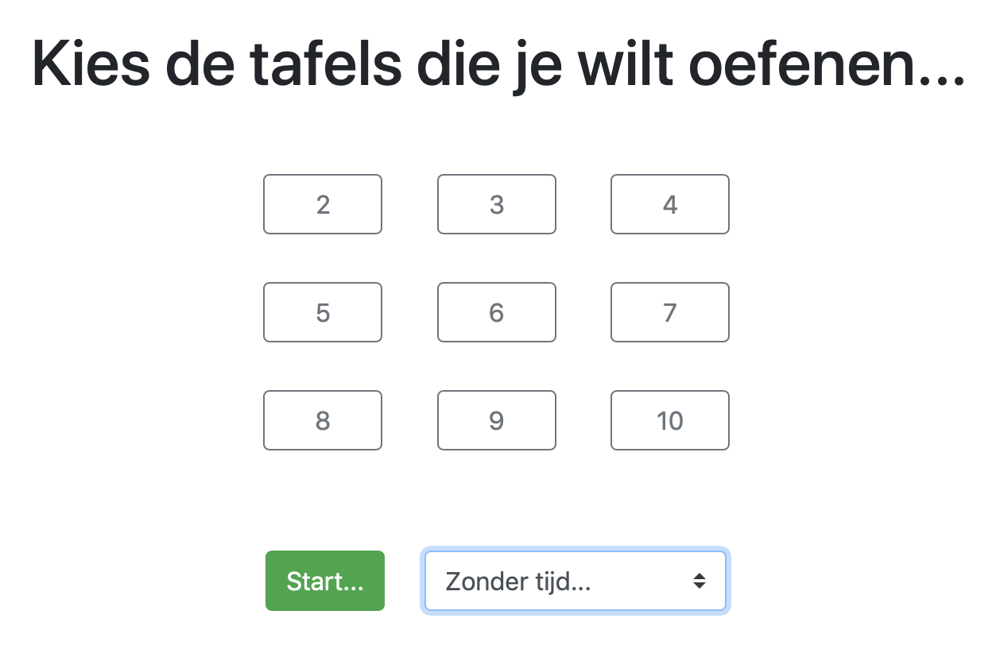
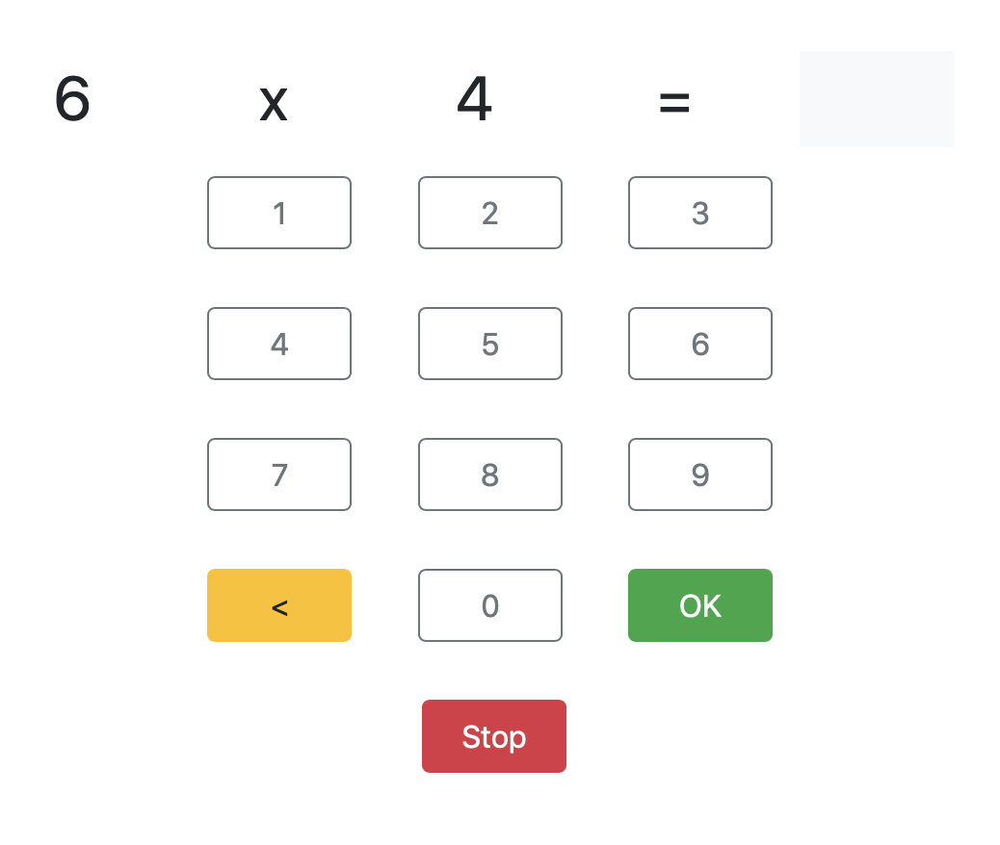
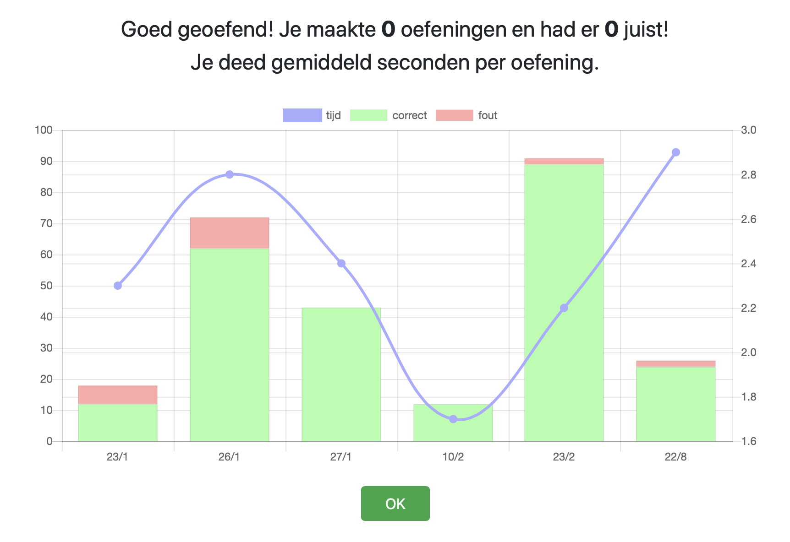
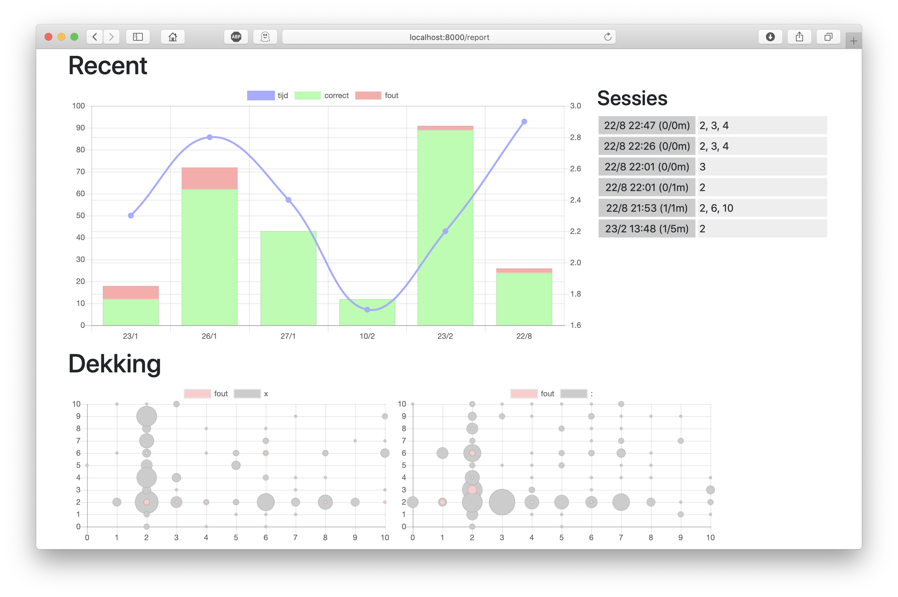

# Maaltafels

[![CI][ci]][ci-link]
[![Made with Python][python]][python-link]
[![uv][uv]][uv-link]
[![Agentic][agentic]][agentic-link]

> Oefen maaltafels met opvolging.

## Features

- Selectie maaltafels
- Tijdopname
- Rapportering van resultaten
- UI gericht op iPad

## Quick Start

### Prerequisites

- Python 3.11+
- [uv](https://docs.astral.sh/uv/) package manager
- MongoDB instance

### Installation

```bash
uv sync
```

### Running

Set the `MONGODB_URI` environment variable and run:

```bash
export MONGODB_URI="mongodb://localhost:27017/maaltafels"
uv run gunicorn maaltafels:server
```

Or use the Makefile:

```bash
make run
```

The application will be available at `http://localhost:8000`.

## Setup

Maak een `users` collection aan, met een document per gebruiker. Bv.:

```javascript
db.users.insertOne({"_id": "default", "pass" : "default"})
db.users.find().pretty()
{ "_id" : "default", "pass" : "default" }
```

## Gebruik

Bezoek de URL van je deployment, geef de gebruikersnaam (`_id`) en het paswoord (`pass`) in.

Selecteer welke maaltafels je wilt oefenen. Kies optioneel hoe lang je wilt oefenen.



Oefenen maar!



Na het oefenen krijg je feedback over je sessie en je evolutie.



## Opvolging

Voeg `/report` toe aan de URL om een rapport over het oefenen te raadplegen.



## Development

```bash
# Install dev dependencies
make env-dev

# Run tests
make test

# Run linting
make lint

# Run all checks
make check
```

[ci]: https://img.shields.io/github/actions/workflow/status/christophevg/maaltafels/test.yaml?branch=master&label=CI
[ci-link]: https://github.com/christophevg/maaltafels/actions/workflows/test.yaml
[python]: https://img.shields.io/badge/Python-3.11+-blue.svg
[python-link]: https://www.python.org/downloads/
[uv]: https://img.shields.io/endpoint?url=https://raw.githubusercontent.com/astral-sh/uv/main/assets/badge/v0.json
[uv-link]: https://docs.astral.sh/uv/
[agentic]: https://img.shields.io/badge/workflow-agentic-blueviolet?style=flat-square
[agentic-link]: https://christophe.vg/about/Agentic-Workflow